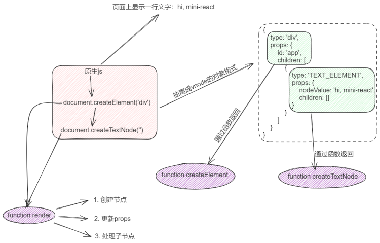
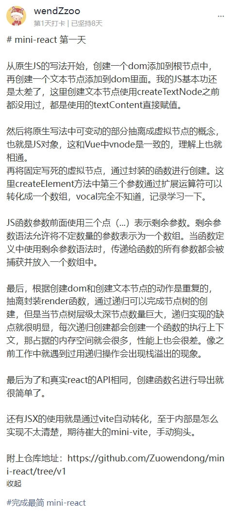
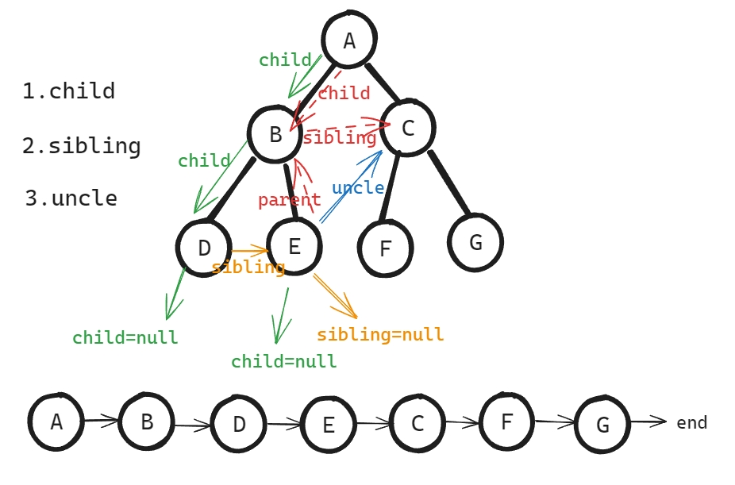
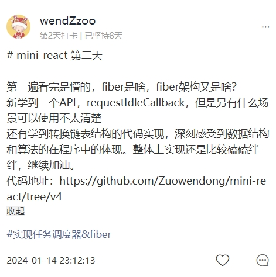
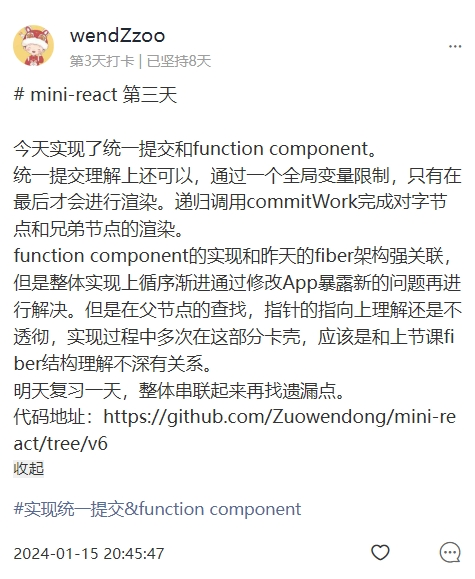
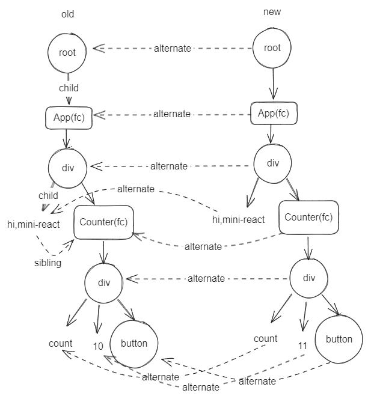
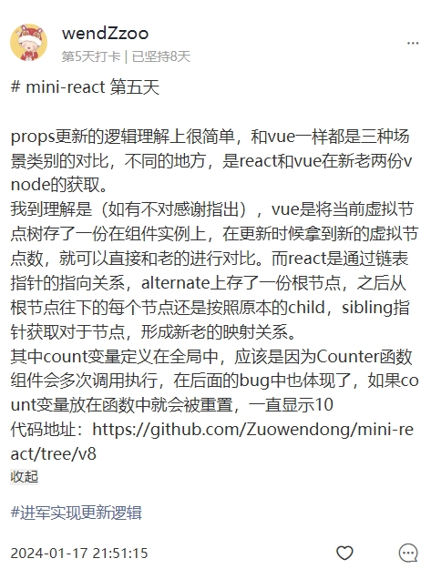
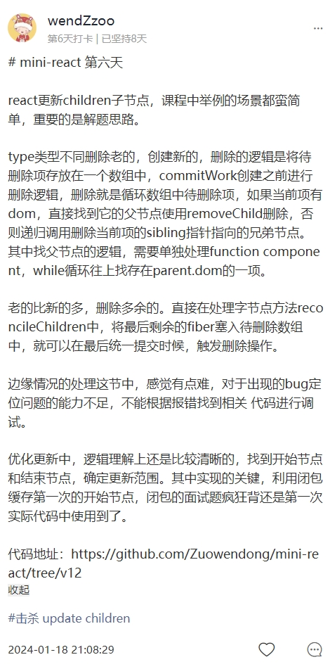
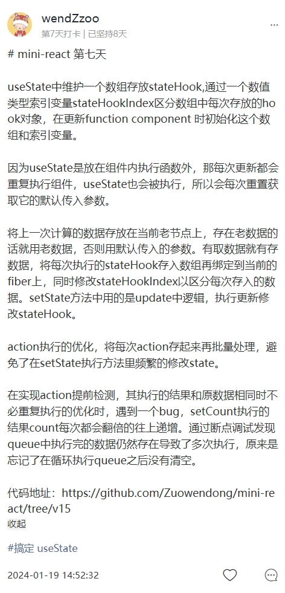
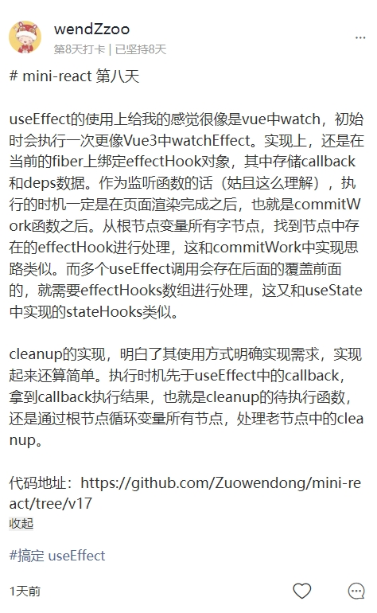

# 开启你的mini-react

## 前言

上周六完结了为期一周的 mini-reac t副本训练营，很开心及时加入了大崔哥的这期小课（30元这点费用成本还不及一顿小烧烤，毫不犹豫~），让我这个纯 Vue 选手稍微对 React 有了点清晰的认识。

每天的打卡任务督促，也让我慢慢实现了自己的 mini-react，仓库地址：https://github.com/Zuowendong/mini-react 

这篇文章完成该副本打卡任务的最后一个任务，输出一篇文章。任务要求是不管是写一个功能的实现 还是写一个问题的解析 在或者是全部的 mini-react ，总之有输出才行。

现在再从头看来，其实每一天学习的知识点都很丰富，足以形成一篇文章进行总结。因此我思考再三，准备以每天实现的功能点都输出一篇文章，开设一个新专栏，以此回顾这一周时间的宝贵回忆。本篇先总结一下整体的 mini-react 作为一个开篇。

这里就简单回顾一下这一周的学习点滴，以作纪念。

## 第一天
2024-01-13周六，副本第一天。经过前一天晚上直播形式的启动仪式，内心是充满了动力。虽然以往周末的日常是在家带娃，但是这天破天荒在宝宝睡着之后抽出了两个小时，开启我的mini-react。

第一天是实现最简单的 mini-react。

无论是Vue 还是 React，都是通过框架的能力在页面中渲染出需要的内容，那其底层的实现都是通过原生JS，创建节点通过`document.createElement`，创建文本节点通过`document.createTextNode`。

框架中都引入了虚拟节点`vnode`的概念，`vnode`本质上就是个 JS 对象，是对元素节点的数据抽象，对象中`type`字段表示节点的类型，例如`div`， `p`等或是文本节点用`TEXT_ELEMENT`表示；`props`字段表示节点的属性对象，其中还包含着子节点`children`，这点和 Vue 稍有不同，Vue 中 `vnode`的 `children`是单独抽离出来作为一个字段。`vnode`的创建通过函数方法的调用，相应的抽离出来的节点的`vnode`，和文本节点的`vnode`，分别创建函数`createElement`和`createTextNode`，函数中逻辑目前很简单，就是单纯的返回出相应的`vnode`对象。

元素节点的创建和文本节点的创建，处理逻辑相似，把这块逻辑抽离出来封装成函数`render`，专门用来处理节点的渲染。文本节点作为元素节点的子节点，`render`中使用递归调用即可完成创建。

大体的思路画了一个图解示意：



此时原生的JS实现页面中渲染需要的内容，但是对比 React ，其调用的 API 还是不相同。

根据vite创建了 React 项目，在项目入口 main.jsx 中，可以看到 React 的 API 是这样的：

```js
ReactDOM.createRoot(document.getElementById('root')).render(<App />)
```

根据 React 的 API，将我们之前实现的逻辑封装，处理成按照这样调用的格式。
第一天的内容相对来说还是很简单的，可能是很久没用原生 JS 的缘故（大概率是我基础太差），原生实现的部分卡壳，但是后来函数的封装上，和之前学习的过的 mini-vue 类似，相对轻松了点。

第一天打卡截图：




## 第二天

周日一大早就打开电脑点开了视频，别问为啥这么早，一把辛酸泪，小宝宝一顿奶顶多撑个 2 小时，一夜起来冲奶三四次，我已经一个多月没有睡整觉。

好在我的精神还不错。

但是点开了视频，殊不知开启了怀疑自我的一天。这天的内容是实现任务调度器和fiber架构。接触到了一个新的原生API `requestIdleCallback`，该方法插入一个函数，这个函数将在浏览器空闲时期被调用。根据大崔哥的画图理解，这采用了分治的思想，相当于把每个渲染节点的任务分成一块块的任务进行处理，使用 `requestIdleCallback` 安排的函数会在浏览器的空闲期间尽快执行。如果函数的执行时间超过了可用的空闲时间，浏览器会将函数重新安排在下一个可用的空闲期间执行。

说实话这里就卡壳了很久，对新知识的接收理解能力下降了很多，还是需要额外多用点时间去补充理解更全面的知识背景和示例实现。

实现`fiber`架构这儿就显得这个副本小课物超所值，所谓`fiber`架构其实内部实现了树形结构转换成链表结构，当时纠结了很久为啥叫`fiber`架构，还特意在直播解答时候提问了，感觉自己陷入了死胡同，其实只是一个称谓而已，我误以为这是 React 源码中特有概念。DOM是树形结构，转换成链表结构可以提高组件的更新和渲染效率。链表结构可以更快地遍历和更新组件，从而提高 React 应用的性能和响应速度。

树形节点转换成链表结构的规则，找到当前节点的孩子节点，即明确`child`指针；如果当前节点不存在孩子节点了，找它的兄弟节点，即明确`sibling`指针；如果兄弟节点也不存在，去找该节点的叔叔节点，叔叔节点的确定需要知道当前节点的父节点，也就是明确`parent`指针，通过当前节点的父节点，再通过父节点找到它的兄弟节点，也是当前节点的叔叔节点。

关系转换的图解示意：



这里的指针关系非常重要，这关乎到后面所有内容的理解。当然，我当时是非常不理解...

第二天打卡截图：



## 第三天

第三天内容是实现统一提交和 `function component`，统一提交是优化更新渲染逻辑，就是把所有的 dom 添加渲染操作滞后；`fc`是 React 的特色了，一个组件就是一个函数。

之前的实现是在创建完节点之后，就将新节点添加到父级容器中，`append`这样的原生方法是很耗费性能的，在大数据量下就导致页面卡顿。优化之后使用统一提交处理，在链表结构处理完，指针关系映射成功之后，在最后进行添加操作。

React 组件支持一个 dom 结构，也支持函数形式。此前实现的都是单纯的一个 dom 结构的组件类型，这里需要处理函数格式，就需要兼容处理，根据type类型来区分。

这里我记得出现过一个小插曲，在还没有实现 `function component` 之前，我尝试在 App 中写这样的格式，

```js
const App = (
  <div>
    hi, mini-react
    <div>
      A
      <div>
        B<div>D</div>
        <div>E</div>
      </div>
      <div>
        C<div>F</div>
        <div>G</div>
      </div>
    </div>
  </div>
);
```

发现页面中是无法正常如期渲染，`F` `G` 都是无法正常渲染的。

在最后实现过程中发现，其实是统一提交的bug，直接把当前节点添加到父级容器中，但是在找节点的叔叔节点时候，父节点不存在兄弟节点的情况，这就需要继续往上找父节点，找到存在兄弟节点的父节点。通过`while`循环一直判断父节点的情况，这和原型链一直向上查找是一个意思。

第三天打卡截图：



## 第四天

复习一天。在群里哀嚎前三天知识量庞大扛不住进度，得到回应，缓冲了一天。

通过这种形式的三天学习，发现自己存在一个问题，看完视频自己实现常常没有思路，很多实现的方向多是对于视频内容的记忆，这种记忆是代码片段的记忆，感觉不算是逻辑上的理解，有时候记忆不深刻的时候卡壳就很难继续下去，需要多看几次视频，加深记忆然后才能默写出来。总感觉自己把大崔哥推崇的这种看完视频自己实现的学习方式搞偏了，很苦恼。

第四天打卡截图：


## 第五天

实现节点属性`props`的更新。有更新就存在新老`vnode`，React 的处理基于之前实现的链表结构，定义一个`alternate`属性指向原本的老节点，这样就关联了新老两份`vnode`。

图解示意就像这样：



更新操作的对比依据`type`判断，类型相同的话就是更新。`props`属性的更新分 3 种场景类型：

1. 老的vnode有，新的vnode没有 
2. 老的vnode没有， 新的vnode有
3. 老的vnode有，新的vnode也有

第 1 种情况直接删除通过`removeAttribute`实现，第 2，3 种情况可以合并，都是新的覆盖老的即可。但是需要注意的是，因为`vnode`数据结构的设计，`children`也在`props`中，因此在循环判断`props`对象中每个属性时，需要移除`children`这个`key`的情况。

第五天打卡截图：



## 第六天

实现子节点`children`的更新。介绍了两种情况，`type`不一致时删除老的，创建新的；老的比新的多的，删除多的节点。第一种情况中，删除操作找到父节点通过`removeChild`方法删除当前节点，把需要删除的节点放入一个数组`deletions`中，在最后统一提交时在处理删除逻辑。删除时找当前节点的父节点，和统一提交时候添加的逻辑相似，需要`while`循环向上一直找到父节点，也需要递归处理子节点。

在遇到需要删除节点的操作，就把待删除的节点塞入到`deletions`数组中，在最后统一提交时候，`commitWork`之前都会处理这个数据进行删除操作，只要这个数组中有值都会触发删除的逻辑。

第六天打卡截图：



## 第七天

实现`useState`

第七天打卡截图：



## 第八天

实现`useEffect`

第八天打卡截图：



## 总结

整体从课程的学习上，其实第二天开始，在理解链表转换那就有点跟不上进度，理解上还不是很透彻，连锁反应也导致了后面几天的内容在自己实现过程中还是很有难度的，因为对于 React 没有深入学习过，也没有实战经验，在最后两天的`useState`和`useEffect`实现中，可能只是明白这个方法是怎么用的，但更多的似乎并不清楚这个方法需要何时用，用在什么地方，从上面也可以看出，在写当天内容总结时我一度卡壳不知道写些什么。

这种疑惑放在 Vue 这儿，对我来说就很好解决，比如，当页面中存在复杂计算逻辑或者需要依据响应式数据变化的，就可以使用`computed`；或者是`watch`侦听器，在需要监听数据变化前后进行业务操作时候就可以使用它。

这种疑惑可能更多的是对 React 的使用空白导致的，毫无使用经验突然接触底层，实现逻辑讲解都明白但是实现目的可能就不太清晰。这就需要后面更多的结合官网和多加练习React写一点demo示例。